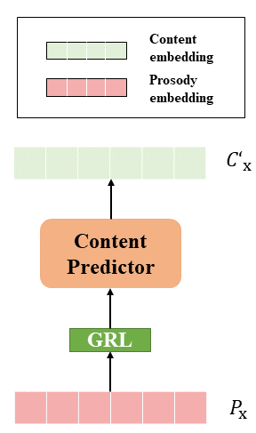

In this post, we show the demo of PMVC: Data Augmentation-Based Prosody Modeling for Expressive Voice Conversion

## Overview

Voice conversion as the style transfer task applied to speech, refers to converting one person's speech into a new speech that sounds like another person's. Up to now, there has been a lot of research devoted to better implementation of VC tasks. However, a good voice conversion model should not only match the timbre information of the target speaker, but also expressive information such as prosody, pace, pause, etc. In this context, prosody modeling is crucial for achieving expressive voice conversion that sounds natural and convincing. Unfortunately, prosody modeling is important but challenging, especially without text transcriptions. In this paper, we firstly propose a novel voice conversion framework named `PMVC', which effectively separates and models the content, timbre, and prosodic information from the speech without text transcriptions. Specially, we introduce a new speech augmentation algorithm for robust prosody extraction. And building upon this, mask and predict mechanism is applied in the disentanglement of prosody and content information. The experimental results on the AIShell-3 corpus supports our improvement of naturalness and similarity of converted speech.

## Model Architecture
<!-- 

    
    

       
&nbsp;
 

Figure.1 The architecture of the functional digestive metabolic network,
 -->

<table>
    <tr>
        <td >
 
</td>
        <td >
 
</td>
    </tr>
	<tr>
        <td>
Framework of PMVC 
</td>
        <td >
Content predictor 
 </td>
    </tr>

	
</table>

The image on the right displays the content predictor, and it's reasonable to anticipate a strong correlation between the predicted content embedding and the actual content. GRL means Gradient Reversal Layer, it will make the optimization goal of the feature encoder and the content predictor completely opposite.

## Demos
We provide audio demo of <PMVC:Data Augmentation-Based Prosody Modeling for Expressive Voice Conversion> in this project.

&nbsp;
 

<table>
	<CAPTION>There are some samples of augmented speech from Random Resampling and Random Prosody (proposed) strategy respectively.</CAPTION>
    <tr>
        <th> ID </th>
		<th> Source speech of speaker SSB0005</th>
        <th> Augmented speech based on RR </th>
        <th> Augmented speech based on RP</th>
    </tr>
    <tr>
        <th> 01 </th>
		<th> <audio controls id="player" onplay="pauseOthers(this);"><source src="assets/audios/Audio/RR and RP/SSB0005/SSB00050001.mp3" type="audio/mpeg"></audio> </th>
        <th> <audio controls id="player" onplay="pauseOthers(this);"><source src="assets/audios/Audio/RR and RP/SSB0005_RR/SSB00050001.mp3" type="audio/mpeg"></audio> </th>
        <th> <audio controls id="player" onplay="pauseOthers(this);"><source src="assets/audios/Audio/RR and RP/SSB0005_RP/SSB00050001.mp3" type="audio/mpeg"></audio> </th>
    </tr>
    <tr>
        <th> 02 </th>
		<th> <audio controls id="player" onplay="pauseOthers(this);"><source src="assets/audios/Audio/RR and RP/SSB0005/SSB00050002.mp3" type="audio/mpeg"></audio> </th>
        <th> <audio controls id="player" onplay="pauseOthers(this);"><source src="assets/audios/Audio/RR and RP/SSB0005_RR/SSB00050002.mp3" type="audio/mpeg"></audio> </th>
        <th> <audio controls id="player" onplay="pauseOthers(this);"><source src="assets/audios/Audio/RR and RP/SSB0005_RP/SSB00050002.mp3" type="audio/mpeg"></audio> </th>
    </tr>
    <tr>
        <th> 03 </th>
		<th> <audio controls id="player" onplay="pauseOthers(this);"><source src="assets/audios/Audio/RR and RP/SSB0005/SSB00050003.mp3" type="audio/mpeg"></audio> </th>
        <th> <audio controls id="player" onplay="pauseOthers(this);"><source src="assets/audios/Audio/RR and RP/SSB0005_RR/SSB00050003.mp3" type="audio/mpeg"></audio> </th>
        <th> <audio controls id="player" onplay="pauseOthers(this);"><source src="assets/audios/Audio/RR and RP/SSB0005_RP/SSB00050003.mp3" type="audio/mpeg"></audio> </th>
    </tr>
    <tr>
        <th> 04 </th>
		<th> <audio controls id="player" onplay="pauseOthers(this);"><source src="assets/audios/Audio/RR and RP/SSB0005/SSB00050004.mp3" type="audio/mpeg"></audio> </th>
        <th> <audio controls id="player" onplay="pauseOthers(this);"><source src="assets/audios/Audio/RR and RP/SSB0005_RR/SSB00050004.mp3" type="audio/mpeg"></audio> </th>
        <th> <audio controls id="player" onplay="pauseOthers(this);"><source src="assets/audios/Audio/RR and RP/SSB0005_RP/SSB00050004.mp3" type="audio/mpeg"></audio> </th>
    </tr>
    <tr>
        <th> 05 </th>
		<th> <audio controls id="player" onplay="pauseOthers(this);"><source src="assets/audios/Audio/RR and RP/SSB0005/SSB00050005.mp3" type="audio/mpeg"></audio> </th>
        <th> <audio controls id="player" onplay="pauseOthers(this);"><source src="assets/audios/Audio/RR and RP/SSB0005_RR/SSB00050005.mp3" type="audio/mpeg"></audio> </th>
        <th> <audio controls id="player" onplay="pauseOthers(this);"><source src="assets/audios/Audio/RR and RP/SSB0005_RP/SSB00050005.mp3" type="audio/mpeg"></audio> </th>
    </tr>
    <tr>
        <th> 06 </th>
		<th> <audio controls id="player" onplay="pauseOthers(this);"><source src="assets/audios/Audio/RR and RP/SSB0005/SSB00050006.mp3" type="audio/mpeg"></audio> </th>
        <th> <audio controls id="player" onplay="pauseOthers(this);"><source src="assets/audios/Audio/RR and RP/SSB0005_RR/SSB00050006.mp3" type="audio/mpeg"></audio> </th>
        <th> <audio controls id="player" onplay="pauseOthers(this);"><source src="assets/audios/Audio/RR and RP/SSB0005_RP/SSB00050006.mp3" type="audio/mpeg"></audio> </th>
    </tr>
    <tr>
        <th> 07 </th>
		<th> <audio controls id="player" onplay="pauseOthers(this);"><source src="assets/audios/Audio/RR and RP/SSB0005/SSB00050007.mp3" type="audio/mpeg"></audio> </th>
        <th> <audio controls id="player" onplay="pauseOthers(this);"><source src="assets/audios/Audio/RR and RP/SSB0005_RR/SSB00050007.mp3" type="audio/mpeg"></audio> </th>
        <th> <audio controls id="player" onplay="pauseOthers(this);"><source src="assets/audios/Audio/RR and RP/SSB0005_RP/SSB00050007.mp3" type="audio/mpeg"></audio> </th>
    </tr>
    <tr>
        <th> 08 </th>
		<th> <audio controls id="player" onplay="pauseOthers(this);"><source src="assets/audios/Audio/RR and RP/SSB0005/SSB00050008.mp3" type="audio/mpeg"></audio> </th>
        <th> <audio controls id="player" onplay="pauseOthers(this);"><source src="assets/audios/Audio/RR and RP/SSB0005_RR/SSB00050008.mp3" type="audio/mpeg"></audio> </th>
        <th> <audio controls id="player" onplay="pauseOthers(this);"><source src="assets/audios/Audio/RR and RP/SSB0005_RP/SSB00050008.mp3" type="audio/mpeg"></audio> </th>
    </tr>
    <tr>
        <th> 09 </th>
		<th> <audio controls id="player" onplay="pauseOthers(this);"><source src="assets/audios/Audio/RR and RP/SSB0005/SSB00050009.mp3" type="audio/mpeg"></audio> </th>
        <th> <audio controls id="player" onplay="pauseOthers(this);"><source src="assets/audios/Audio/RR and RP/SSB0005_RR/SSB00050009.mp3" type="audio/mpeg"></audio> </th>
        <th> <audio controls id="player" onplay="pauseOthers(this);"><source src="assets/audios/Audio/RR and RP/SSB0005_RP/SSB00050009.mp3" type="audio/mpeg"></audio> </th>
    </tr>
    <tr>
        <th> 10 </th>
		<th> <audio controls id="player" onplay="pauseOthers(this);"><source src="assets/audios/Audio/RR and RP/SSB0005/SSB00050010.mp3" type="audio/mpeg"></audio> </th>
        <th> <audio controls id="player" onplay="pauseOthers(this);"><source src="assets/audios/Audio/RR and RP/SSB0005_RR/SSB00050010.mp3" type="audio/mpeg"></audio> </th>
        <th> <audio controls id="player" onplay="pauseOthers(this);"><source src="assets/audios/Audio/RR and RP/SSB0005_RP/SSB00050010.mp3" type="audio/mpeg"></audio> </th>
    </tr>
	
</table>

&nbsp;
 

<table>
	<CAPTION>Converted Speech</CAPTION>
    <tr>
        <th> ID </th>
		<th> Type </th>
        <th>Source </th>
        <th>Target </th>
        <th>Coverted_PMVC </th>
        <th>Coverted_Speechflow </th>
        <th>Coverted_autoVC </th>
    </tr>
    <tr>
        <th> 01 </th>
        <th> F-M </th>
		<th> <audio controls id="player" onplay="pauseOthers(this);"><source src="assets/audios/Audio/Converted Speech/F-M/SSB00110010_src.mp3" type="audio/mpeg"></audio> </th>
        <th> <audio controls id="player" onplay="pauseOthers(this);"><source src="assets/audios/Audio/Converted Speech/F-M/SSB00730174_tar.mp3" type="audio/mpeg"></audio> </th>
        <th> <audio controls id="player" onplay="pauseOthers(this);"><source src="assets/audios/Audio/Converted Speech/F-M/A.mp3" type="audio/mpeg"></audio> </th>
        <th> <audio controls id="player" onplay="pauseOthers(this);"><source src="assets/audios/Audio/Converted Speech/F-M/B.mp3" type="audio/mpeg"></audio> </th>
        <th> <audio controls id="player" onplay="pauseOthers(this);"><source src="assets/audios/Audio/Converted Speech/F-M/C.mp3" type="audio/mpeg"></audio> </th>
   </tr>
   <tr>
        <th> 02 </th>
        <th> M-F </th>
		<th> <audio controls id="player" onplay="pauseOthers(this);"><source src="assets/audios/Audio/Converted Speech/M-F/SSB00730174_src.mp3" type="audio/mpeg"></audio> </th>
        <th> <audio controls id="player" onplay="pauseOthers(this);"><source src="assets/audios/Audio/Converted Speech/M-F/SSB00110010_tar.mp3" type="audio/mpeg"></audio> </th>
        <th> <audio controls id="player" onplay="pauseOthers(this);"><source src="assets/audios/Audio/Converted Speech/M-F/A.mp3" type="audio/mpeg"></audio> </th>
        <th> <audio controls id="player" onplay="pauseOthers(this);"><source src="assets/audios/Audio/Converted Speech/M-F/B.mp3" type="audio/mpeg"></audio> </th>
        <th> <audio controls id="player" onplay="pauseOthers(this);"><source src="assets/audios/Audio/Converted Speech/M-F/C.mp3" type="audio/mpeg"></audio> </th>
   </tr>
   <tr>
        <th> 03 </th>
        <th> M-M </th>
		<th> <audio controls id="player" onplay="pauseOthers(this);"><source src="assets/audios/Audio/Converted Speech/M-M/SSB00730174_src.mp3" type="audio/mpeg"></audio> </th>
        <th> <audio controls id="player" onplay="pauseOthers(this);"><source src="assets/audios/Audio/Converted Speech/M-M/SSB01390310_tar.mp3" type="audio/mpeg"></audio> </th>
        <th> <audio controls id="player" onplay="pauseOthers(this);"><source src="assets/audios/Audio/Converted Speech/M-M/A.mp3" type="audio/mpeg"></audio> </th>
        <th> <audio controls id="player" onplay="pauseOthers(this);"><source src="assets/audios/Audio/Converted Speech/M-M/B.mp3" type="audio/mpeg"></audio> </th>
        <th> <audio controls id="player" onplay="pauseOthers(this);"><source src="assets/audios/Audio/Converted Speech/M-M/C.mp3" type="audio/mpeg"></audio> </th>
   </tr>
</table>
